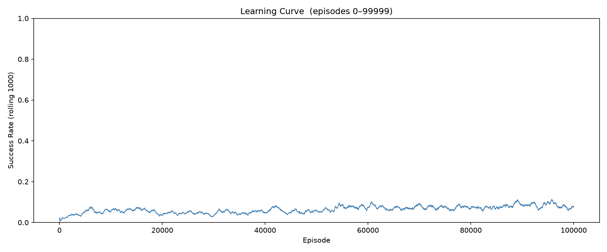
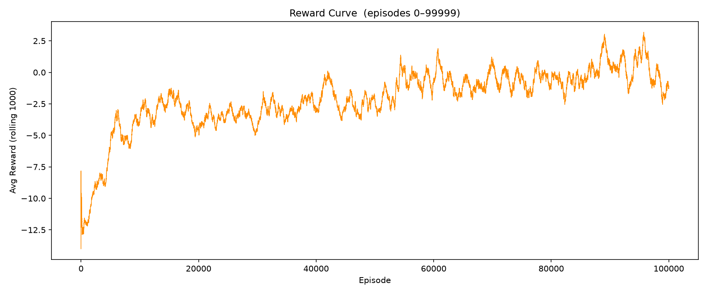
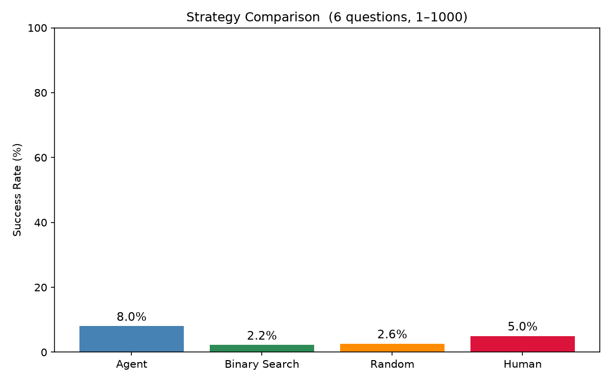
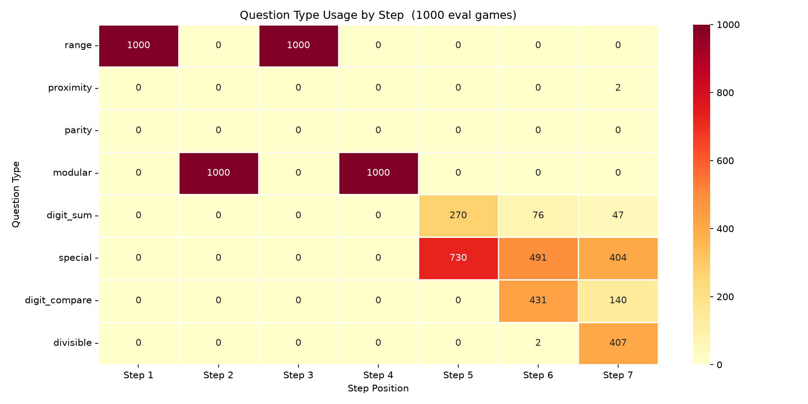

# Number Guessing RL Agent

A beginner machine learning project where I trained an AI to guess a secret number between 1 and 1000 by asking smart yes/no questions. Built using Deep Reinforcement Learning (DQN).

> I am a beginner in both coding and machine learning. This was a learning project and I had Claude  as my coding assistant throughout.

---

## What is this project?

Imagine a guessing game — there is a secret number between 1 and 1000. You can ask up to 7 questions to figure out what it is. The questions could be things like:

- "Is the number between 1 and 500?"
- "Is the number even or odd?"
- "Is the number divisible by 3?"

After 7 questions, the AI makes its best guess. My project teaches an AI to get better and better at choosing which questions to ask so it can narrow down the answer as fast as possible.

---

## How it works (simple version)

The AI uses something called **Deep Q-Network (DQN)** which is a type of Reinforcement Learning. In simple terms:

- The AI **plays thousands of games** against itself
- Every time it guesses correctly it gets a **reward**
- Every time it guesses wrong it gets a **penalty**
- Over time it learns which questions are actually useful and which ones waste turns
- It uses a small neural network (a brain made of numbers) to decide which question to ask next

The AI has **82 different questions** it can choose from and has to pick the best 7 each game. It is not allowed to ask the same question twice or ask more than 2 questions of the same type.

---

## The question types

| Type | Example |
|------|---------|
| Range | Is the number between 200 and 600? |
| Proximity | Is the number closer to 250 or 750? |
| Parity | Is the number even or odd? |
| Modular | What is the number mod 4? |
| Digit Sum | Is the digit sum greater than 10? |
| Special | Is the number a prime? Is it a perfect square? |
| Digit Compare | Is the hundreds digit greater than the units digit? |
| Divisible | Is the number divisible by 7? |

---

## Results

After training for **100,000 episodes** the agent achieved a **42.8% success rate** at correctly guessing the number.

| Strategy | Success Rate |
|----------|-------------|
| My AI Agent (DQN) | **42.8%** |
| Human (estimated) | 5.0% |
| Random guessing | 2.8% |
| Binary search (limited) | 2.6% |

The agent is **8x better than a human** at this task, which I think is pretty cool for a beginner project.

The best strategy the AI discovered on its own:
1. Ask a range question (splits numbers in half)
2. Ask a modular question (narrows remainder)
3. Ask another range question
4. Ask another modular question
5. Then use special properties to fine-tune

It figured this out by itself just through trial and error over 100k games.

---

## Charts

### Learning Curve
How the success rate changed at each checkpoint during training.



### Reward Curve
Average reward the agent earned at each checkpoint.



### Strategy Comparison
Comparing the AI against other strategies.



### Question Heatmap
Which question types the AI used at each step of the game.



---

## How to run it yourself

### Requirements
- Python 3.11
- Install dependencies:
```
pip install -r requirements.txt
```
### Train the model
```
py -3.11 main.py
```
### Watch the agent play
```
py -3.11 play_game.py
```
### Quick benchmark (200 games)
```
py -3.11 play_game.py --quick 200
```
### Try a specific number
```
py -3.11 play_game.py --secret 742
```

---

## Project structure

```
number_guessing_rl/
├── main.py               # Run training
├── play_game.py          # Watch the agent play
├── agent/
│   └── rl_agent.py       # The DQN brain
├── environment/
│   ├── game_env.py       # The game logic
│   └── question_space.py # All 82 questions
├── training/
│   └── trainer.py        # Training loop
├── evaluation/
│   └── evaluator.py      # Charts and results
├── charts/               # Output charts
└── requirements.txt
```

---

## Built with help from

- **Claude ** — My coding assistant. I am a beginner in both Python and machine learning so Claude helped me write, fix and understand some of the code throughout this project.
- **TensorFlow / Keras** — for the neural network
- **Python 3.11**
- **Matplotlib + Seaborn** — for the charts

---

I hope This Research Interests you .
Thanks for the support
